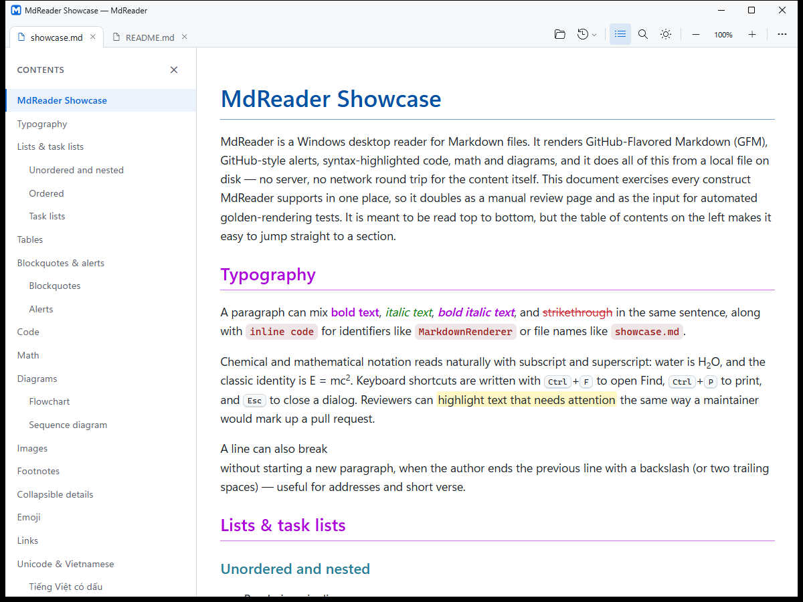

# MdReader

A small Markdown reader for Windows. Double-click a `.md` file and read it with proper formatting, code highlighting, diagrams and math, in light or dark mode.

There's also a web version at <https://mdreader.fly.dev>. Paste some Markdown or open a few files, and read them in your browser.



## Download

- **Windows:** [MdReader-Setup.exe](https://github.com/quanrealvn/mdreader/releases/latest/download/MdReader-Setup.exe). Works on Windows 10 and 11. The installer isn't signed yet, so Windows may show a SmartScreen warning. Click "More info", then "Run anyway".
- **VS Code:** [mdreader-vscode.vsix](https://github.com/quanrealvn/mdreader/releases/latest/download/mdreader-vscode.vsix) adds an "Open in MdReader" command. In VS Code, go to Extensions, open the "…" menu and pick "Install from VSIX".

To make MdReader your default for `.md` files, right-click one, choose **Open with** → **Choose another app**, pick MdReader and tick **Always**.

## What it does

- GitHub-flavored Markdown, including alerts, tables, footnotes and task lists
- Code highlighting, Mermaid diagrams and KaTeX math
- Tabs that come back the next time you open it, and files that reload by themselves when you save them
- Tick task-list checkboxes while reading, and they are saved back to the file
- Side by side: type on the left, see it rendered on the right
- Contents panel you can filter and sort, find, zoom, print and PDF export
- Colorful or classic style, light or dark theme

## Building it

You need Windows, the .NET 10 SDK and the WebView2 runtime (Windows 11 already has it).

```
dotnet build MdReader.slnx
```

`installer\build.ps1` builds the installer (you'll need Inno Setup 6), and `dotnet run --project src\MdReader.Web` starts the web version locally.

## License

MIT
