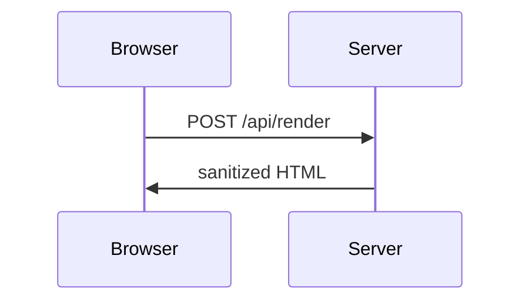

## Headings

```markdown
# Heading 1
## Heading 2
### Heading 3
#### Heading 4
##### Heading 5
###### Heading 6
```

Six levels. The space after the hashes is required. They are shown as source here rather
than rendered, because six real headings in the middle of this page would leave it with an
outline nobody could follow. The section titles you are reading are `##`.

Every heading gets an id, so `[jump](#headings)` links to the one above.

## Emphasis

```markdown
*italic* and _italic_
**bold** and __bold__
***bold italic***
~~struck through~~
`inline code`
```

*italic* and _italic_
**bold** and __bold__
***bold italic***
~~struck through~~
`inline code`

Prefer `*` and `**` for emphasis. The underscore forms do not work inside a word, so
`snake_case_name` stays intact, which is usually what you want.

## Paragraphs and line breaks

A blank line starts a new paragraph. A single newline does not: two lines with nothing
between them become one paragraph.

To break a line without starting a paragraph, end it with a backslash, or with two
spaces:

```markdown
First line\
second line
```

First line\
second line

## Lists

```markdown
- Apples
- Pears
  - Conference
  - Comice
- Plums

1. Clone the repository
2. Install the dependencies
3. Run the tests
```

- Apples
- Pears
  - Conference
  - Comice
- Plums

1. Clone the repository
2. Install the dependencies
3. Run the tests

Indent a nested item by two spaces under an unordered parent. Numbers in an ordered list
do not have to be right; `1.` on every line renumbers correctly, which keeps diffs small.

## Task lists

```markdown
- [x] Write the parser
- [ ] Write the tests
- [ ] Write the documentation
```

- [x] Write the parser
- [ ] Write the tests
- [ ] Write the documentation

The space inside the brackets is required. `[X]` works as well as `[x]`.

## Links

```markdown
[A link](https://example.com)
[With a title](https://example.com "Shown on hover")
<https://example.com>
https://example.com

[A reference link][ref]

[ref]: https://example.com
```

[A link](https://example.com)
[With a title](https://example.com "Shown on hover")
<https://example.com>
https://example.com

[A reference link][ref]

[ref]: https://example.com

Reference definitions can sit anywhere in the file, and they do not appear in the output.
They are worth using when the same URL appears several times, or when a long URL makes a
paragraph unreadable in the source.

## Images

```markdown


```

The syntax is a link with an exclamation mark in front. The alt text is not decoration:
it is what a screen reader reads and what shows if the image fails.

## Code

Inline code goes between backticks. To put a backtick inside inline code, use two
backticks as the delimiter: ``a ` backtick``.

A fenced block takes a language after the opening fence:

````markdown
```python
def area(radius: float) -> float:
    return math.pi * radius ** 2
```
````

```python
def area(radius: float) -> float:
    return math.pi * radius ** 2
```

Use four backticks to fence a block that itself contains a three-backtick fence.

## Blockquotes

```markdown
> A quote.
>
> > And one inside it.
```

> A quote.
>
> > And one inside it.

## Alerts

```markdown
> [!NOTE]
> Useful information a reader should notice even when skimming.

> [!WARNING]
> Needs immediate attention because of the risk.
```

> [!NOTE]
> Useful information a reader should notice even when skimming.

> [!WARNING]
> Needs immediate attention because of the risk.

The five kinds are `NOTE`, `TIP`, `IMPORTANT`, `WARNING` and `CAUTION`. The keyword goes
on the first line of the blockquote, in brackets, after an exclamation mark.

## Tables

```markdown
| Package | Version | Notes    |
| ------- | :-----: | -------: |
| markdig | 1.4.0   | Parser   |
| katex   | 0.18.7  | Math     |
```

| Package | Version | Notes    |
| ------- | :-----: | -------: |
| markdig | 1.4.0   | Parser   |
| katex   | 0.18.7  | Math     |

The dash row is what makes it a table, and the colons in it set each column's alignment:
left, centred, right. The pipes do not have to line up in the source. Escape a pipe inside
a cell as `\|`.

## Footnotes

```markdown
A claim that needs a source.[^1]

[^1]: The source, at the bottom of the page.
```

A claim that needs a source.[^1]

[^1]: The source, at the bottom of the page.

The note is moved to the end of the document with a link back to where it was referenced.

## Definition lists

```markdown
Markdig
:   The parser MdReader uses.

KaTeX
:   The typesetter for math.
```

Markdig
:   The parser MdReader uses.

KaTeX
:   The typesetter for math.

The colon needs at least three spaces after it, or a tab. With one space the line stays
an ordinary paragraph and nothing tells you why.

## Horizontal rule

Three or more hyphens, asterisks or underscores on a line of their own:

```markdown
---
```

---

Put a blank line before the hyphens. Directly under a line of text they would turn it into
a heading instead.

## Math

```markdown
Inline: $E = mc^2$

$$
\sum_{i=1}^{n} i = \frac{n(n+1)}{2}
$$
```

Inline: $E = mc^2$

$$
\sum_{i=1}^{n} i = \frac{n(n+1)}{2}
$$

One dollar sign on each side for inline math, two for a block. Escape a literal dollar
sign as `\$`.

## Diagrams

````markdown

````


A fenced block marked `mermaid` is drawn by Mermaid instead of being printed as code.

## Emoji

```markdown
:rocket: :bug: :tada:
```

:rocket: :bug: :tada:

## Raw HTML

Markdown that does not cover what you need falls back to HTML:

```markdown
<details>
<summary>Things that did not fit anywhere else</summary>

Press <kbd>Ctrl</kbd> + <kbd>F</kbd> to search. H<sub>2</sub>O and E = mc<sup>2</sup>.

</details>
```

<details>
<summary>Things that did not fit anywhere else</summary>

Press <kbd>Ctrl</kbd> + <kbd>F</kbd> to search. H<sub>2</sub>O and E = mc<sup>2</sup>.

</details>

Leave a blank line after `<summary>` or the Markdown inside will not be parsed. Tags that
can run or navigate are removed before the page is assembled.

## Escaping

A backslash turns the character after it into itself:

```markdown
\*not italic\*  \# not a heading  \| not a cell
```

\*not italic\*  \# not a heading  \| not a cell

The characters worth remembering: `` \ ` * _ { } [ ] ( ) # + - . ! | ``

## Front matter

```markdown
---
title: A document
date: 2026-09-28
---
```

A YAML block at the very top of the file, between two lines of three hyphens. It is
recognised and hidden rather than printed as a table.
