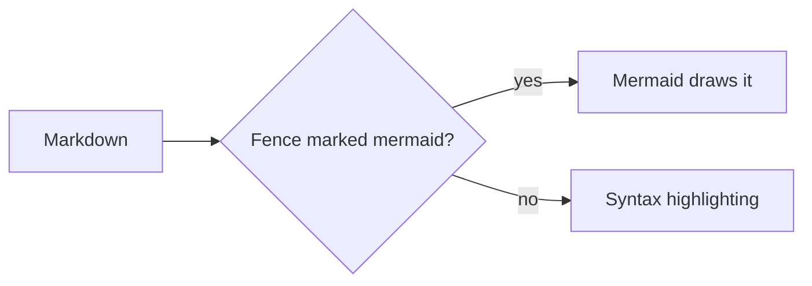

## How a diagram gets on the page

Mark a fenced code block as `mermaid` and its contents go to Mermaid instead of being
printed as code:

````markdown

````

That is the same thing GitHub does with a `mermaid` fence, and the same thing the desktop
app does. The document is rendered to HTML first and the diagram is drawn afterwards, in
your browser.

## Which version, and where it comes from

Mermaid 12.0.0, bundled with the page. Nothing is fetched from a CDN, so the version you
get is the one MdReader shipped and it does not change under you.

The bundle is five megabytes, so it is fetched only once a document actually contains a
diagram. A page with no `mermaid` fence never downloads it.

## Getting the diagram out

There is no export button. The diagram is an SVG element in the page, so printing to PDF
keeps it as a vector drawing that stays sharp at any zoom. For a file, Mermaid's own
editor at <https://mermaid.live> has one, and takes the same source.

## Errors, themes and scrolling

A diagram that Mermaid cannot parse shows Mermaid's own error message in the place the
diagram would have taken, and the rest of the document renders as normal. One bad diagram
does not cost you the page.

Switching between light and dark redraws every diagram with the matching palette, rather
than leaving dark lines on a light box.

Diagrams below the fold are drawn as you scroll towards them. A document with thirty
diagrams in it stays responsive because twenty-nine of them have not been drawn yet.
