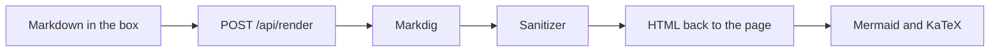
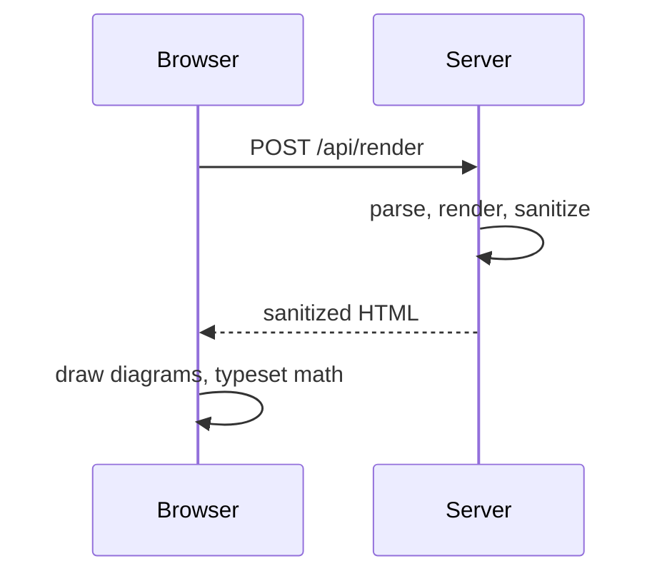

## How a render travels

```mermaid
flowchart LR
  A[Markdown in the box] --> B[POST /api/render]
  B --> C[Markdig]
  C --> D[Sanitizer]
  D --> E[HTML back to the page]
  E --> F[Mermaid and KaTeX]
```

```mermaid
sequenceDiagram
  participant B as Browser
  participant S as Server
  B->>S: POST /api/render
  S->>S: parse, render, sanitize
  S-->>B: sanitized HTML
  B->>B: draw diagrams, typeset math
```
